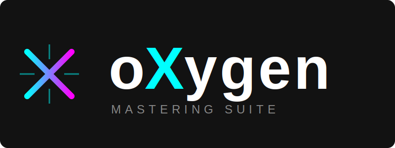
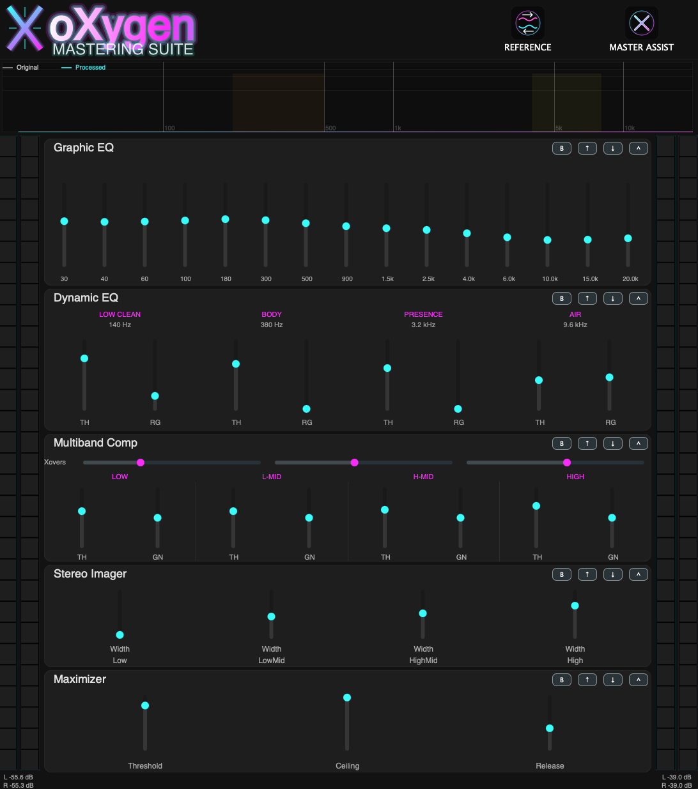

# oXygen Mastering Suite

**oXygen** is a free and open-source mastering plugin built with C++ and JUCE. The project is focused on a practical mastering workflow: corrective EQ, multiband control, stereo shaping, final loudness, and an automatic Master Assistant that listens to the incoming mix and writes settings into the modules.

The current codebase is **cross-platform by design**, but the most actively used and validated path right now is **macOS VST3**. Windows and Linux build paths exist in CMake and remain part of the roadmap, but they still need more validation, packaging work, and real-world testing.


[](https://ko-fi.com/wamphyre94078)





## Features

### Core Functionality
- **Master Assistant**: Listens to up to 60 seconds of incoming audio, analyzes tonal balance, dynamics, stereo spread, loudness, and true peak behaviour, then proposes settings for the processing chain.
- **15-Band Graphic EQ**: Fixed-band mastering EQ from `30 Hz` to `20 kHz`, with smoothed gain changes and a more musical Q contour across the spectrum.
- **4-Band Multiband Compressor**: Low, Low-Mid, High-Mid, and High bands with stereo-linked detection, hybrid peak/RMS behaviour, and softer knee handling for better glue.
- **Stereo Imager**: Multiband width control with safeguards intended to keep the low end more mono-compatible and prevent obviously unstable widening.
- **Gain Stage**: Dedicated trim stage for workflow and level management inside the chain.
- **Maximizer**: Final loudness processor with lookahead, internal oversampling, adaptive release, and host latency reporting.

### Audio Engine
- **Modular Signal Chain**: Built on `juce::AudioProcessorGraph` and designed around a mastering rack workflow.
- **Current Module Order**: `Graphic EQ -> Multiband Comp -> Stereo Imager -> Gain -> Maximizer`.
- **Reorder / Bypass / Collapse**: Each module can be moved, bypassed, or collapsed from the rack UI.
- **Original vs Processed Analyzer**: The spectrum display overlays the incoming signal and the processed output so tonal changes can be checked visually.
- **Mono / Stereo Compatibility**: The plugin supports mono and stereo bus layouts and routes the chain coherently through to the final output.
- **Single and Double Precision Host Paths**: The plugin accepts both float and double precision processing from the host. DSP refinement is still ongoing module by module.

## System Requirements

### macOS
- **Format**: VST3
- **Status**: Current primary development and validation platform
- **Build Path**: Supported directly with `build.sh` or manual CMake

### Windows
- **Format**: VST3
- **Status**: Codebase and CMake path exist, but validation and packaging are still in progress
- **Build Path**: Manual CMake / Visual Studio workflow

### Linux
- **Format**: VST3
- **Status**: CMake path is present, but Linux support is still under active development and needs more testing
- **Build Path**: Manual CMake workflow

## Build from Source

### macOS

#### Dependencies
- **Xcode Command Line Tools** (`xcode-select --install`)
- **CMake 3.22+**
- **Git**

#### Build Steps
1. **Clone the repository**
   ```bash
   git clone https://github.com/Wamphyre/oXygen.git
   cd oXygen
   ```

2. **Build with the helper script**
   ```bash
   ./build.sh
   ```

3. **Or build manually**
   ```bash
   cmake -B build -DCMAKE_BUILD_TYPE=Release
   cmake --build build --config Release
   ```

4. **Artifacts**
   The build places the VST3 bundle in:
   ```text
   releases/oXygen.vst3
   ```

> Note: if the `JUCE/` folder is not present locally, CMake will fetch JUCE automatically during configuration.

---

### Windows

#### Dependencies
- **Visual Studio 2022** with `Desktop development with C++`
- **CMake 3.22+**
- **Git**

#### Build Steps
1. **Clone the repository**
   ```powershell
   git clone https://github.com/Wamphyre/oXygen.git
   cd oXygen
   ```

2. **Configure**
   ```powershell
   cmake -B build
   ```

3. **Build**
   ```powershell
   cmake --build build --config Release
   ```

4. **Artifacts**
   ```text
   releases/oXygen.vst3
   ```

> Note: Windows support is not yet considered fully validated. Expect further iteration on packaging, testing, and deployment details.

---

### Linux

#### Dependencies
- **GCC or Clang** with C++20 support
- **CMake 3.22+**
- **Git**
- **Ninja** or **Make**

#### Build Steps
1. **Clone the repository**
   ```bash
   git clone https://github.com/Wamphyre/oXygen.git
   cd oXygen
   ```

2. **Configure**
   ```bash
   cmake -B build -DCMAKE_BUILD_TYPE=Release
   ```

3. **Build**
   ```bash
   cmake --build build --config Release
   ```

4. **Artifacts**
   ```text
   releases/oXygen.vst3
   ```

> Note: Linux support is still work in progress and should be treated as experimental until more validation is completed.

## Usage

### Usage Guide
1. **Insert oXygen on your master bus**. The plugin is mainly intended for stereo mix-bus / master-bus mastering, but it can also be used on stems or individual tracks when needed.
2. **Feed it representative material**. If you plan to use the Master Assistant, play the loudest or most information-rich section of the mix rather than a quiet intro.
3. **Run Master Assist**. The plugin enters a listening state, shows a progress window, and captures up to 60 seconds of real incoming audio.
4. **Confirm the proposal**. After the listening pass, oXygen generates suggested settings and asks for confirmation before writing them into the modules.
5. **Check the analyzer overlay**. Use the `Original` and `Processed` spectrum curves to verify what changed instead of judging only by output loudness.
6. **Refine manually**. Treat the assistant as a starting point, then fine-tune EQ, compression, stereo width, gain staging, and maximizer settings for the final result.
7. **Level-match your decisions**. Louder often sounds better at first; compare with care when deciding whether processing is actually improving the mix.

### Manual Control
- **Graphic EQ**: Use it for broad tonal correction and enhancement. Remove obvious mud, harshness, or imbalance before pushing top-end shine.
- **Multiband Comp**: Use it for glue and control, not constant pumping. Small moves usually work better than extreme thresholds.
- **Stereo Imager**: Widen upper bands carefully. Keep low frequencies conservative if you want safer mono translation.
- **Gain**: Use this stage to manage level into the maximizer and keep the overall chain under control.
- **Maximizer**: Use it as the final loudness stage. Raise loudness logically, but leave enough headroom to avoid turning the master brittle.

## Support & Donations
If you find oXygen useful and want to support its development, consider supporting the project:

[](https://ko-fi.com/wamphyre94078)

---

Built for iterative mastering development, with more platform validation and DSP refinement still ahead.

